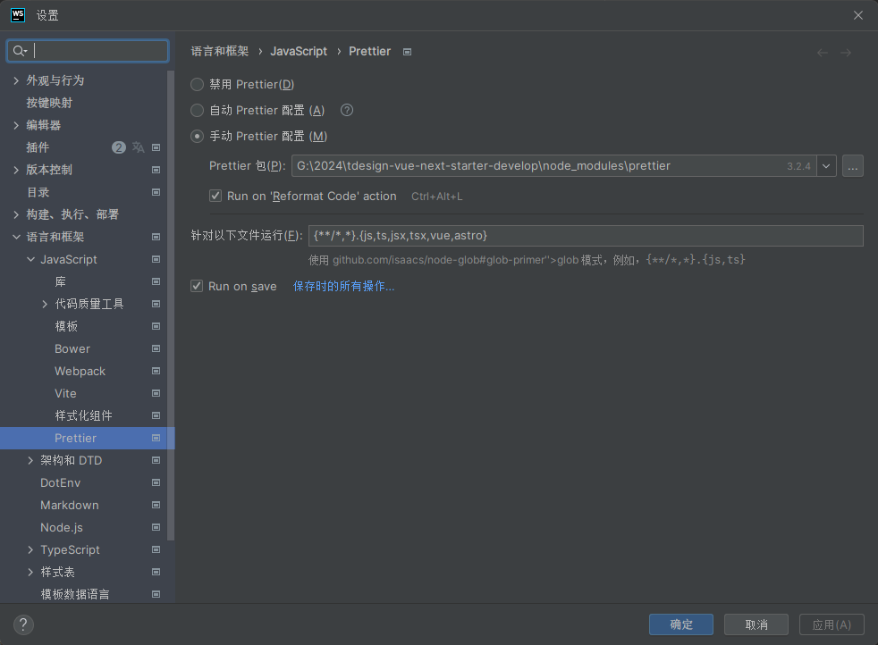
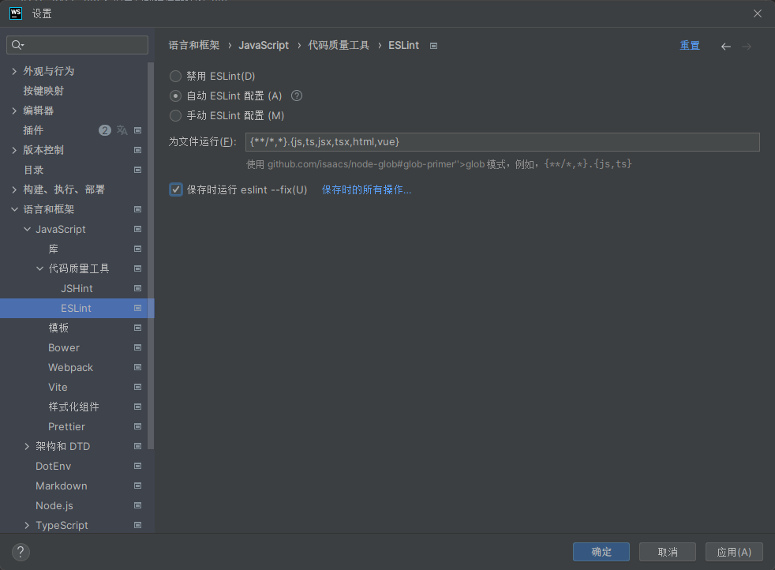

---
# 这是文章的标题
title: 开发规范
# 这是侧边栏的顺序
order: 2
# 设置作者
author: MoTou
# 设置写作时间
date: 2024-01-19
# 一个页面可以有多个标签
tag:
  - 规范
---
为了维护项目的代码质量，项目中内置了格式化代码的工具 `Prettier` 和代码检测质量检查工具 `ESlint`。

同时，也推荐您在开发过程中遵循提交规范，以保持项目仓库的分支、提交信息的清晰整洁。

## 代码编写规范

### Prettier 配置
[Prettier](https://prettier.io/docs/en/) 是一个代码格式化程序,它删除所有原始样式，并确保所有输出的代码都符合一致的样式。
#### WebStorm
配置参数如图

#### Visual Studio Code
官方插件：[Prettier - Code formatter](https://marketplace.visualstudio.com/items?itemName=esbenp.prettier-vscode)

> 如果要打开和关闭格式化程序，请安装[vscode-status-bar-format-toggle](https://marketplace.visualstudio.com/items?itemName=tombonnike.vscode-status-bar-format-toggle)

### Eslint 配置
ESLint 是一个根据方案识别并报告 ECMAScript/JavaScript 代码问题的工具，其目的是使代码风格更加一致并避免错误。在很多地方它都与 JSLint 和 JSHint 类似。

#### WebStorm

> 默认情况下，ESLint 处于禁用状态。您可以选择自动配置它或手动指定所有配置设置。

- 自动配置 ESLint

WebStorm 使用项目node_modules文件夹中的 ESLint 包和存储当前文件的文件夹中的 .eslintrc.* 配置文件。如果在当前文件夹中找不到 .eslintrc.*，WebStorm 将在其父文件夹中查找一个，直到项目根目录。

如果将 ESLint 列为依赖项的多个package.json文件，WebStorm 会为每个package.json启动一个单独的进程，并处理其下的所有内容。这允许您将特定的 ESLint 版本或一组特定的插件应用于 monorepo 或具有多个 ESLint 配置的项目中的每个路径。

#### Visual Studio Code
官方插件：[vscode-eslint](https://marketplace.visualstudio.com/items?itemName=dbaeumer.vscode-eslint)

## 分支规范

- 主干分支 -- develop
- 功能分支 -- feature
- 修复分支 -- hotfix

`develop`分支只接受通过 `Merge Request` 合入功能分支。

为保证提交的记录干净整洁，其他分支合入之前需要先 `rebase develop` 分支。

分支命名规则：`feature/20210401_`功能名称。
