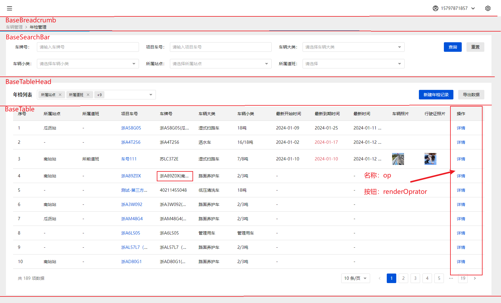
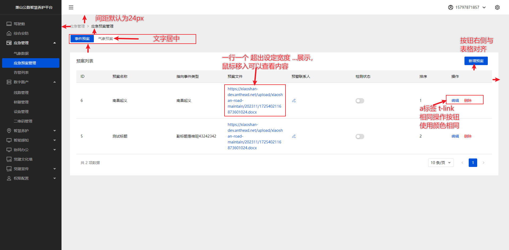
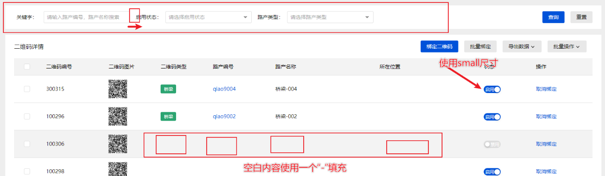
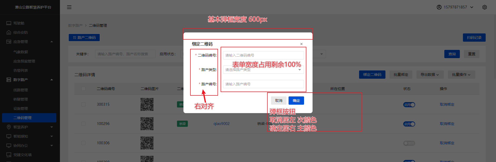
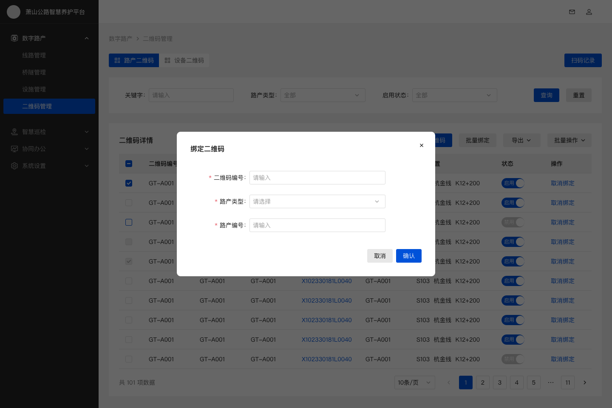
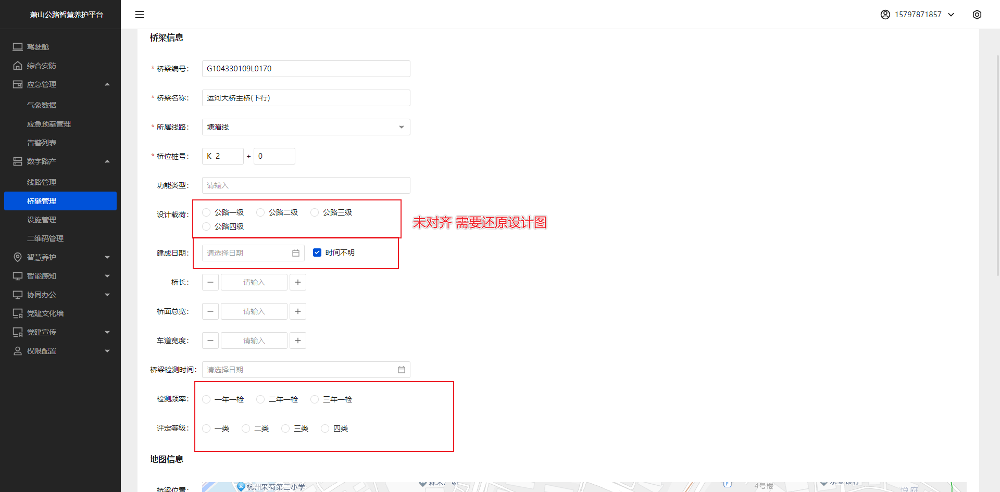
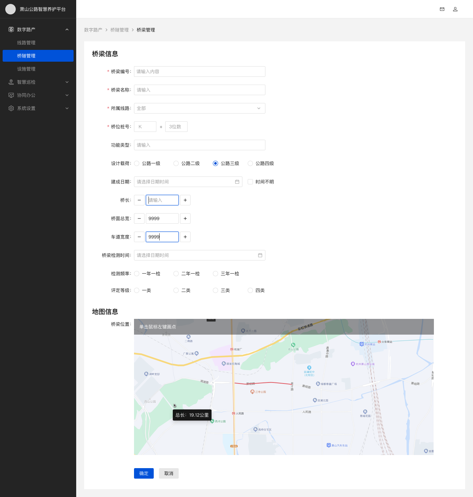
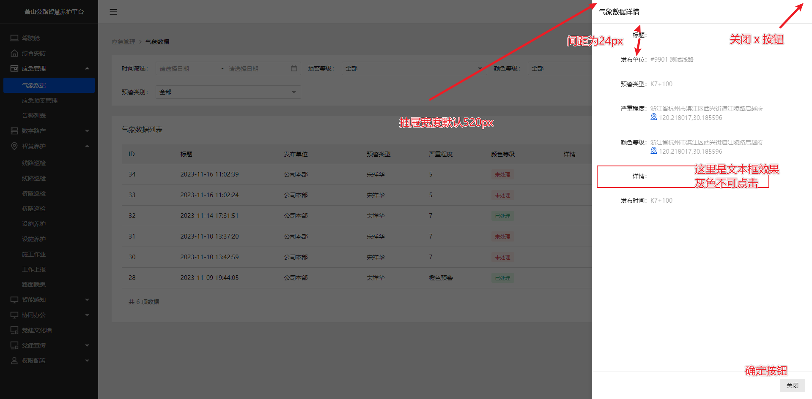
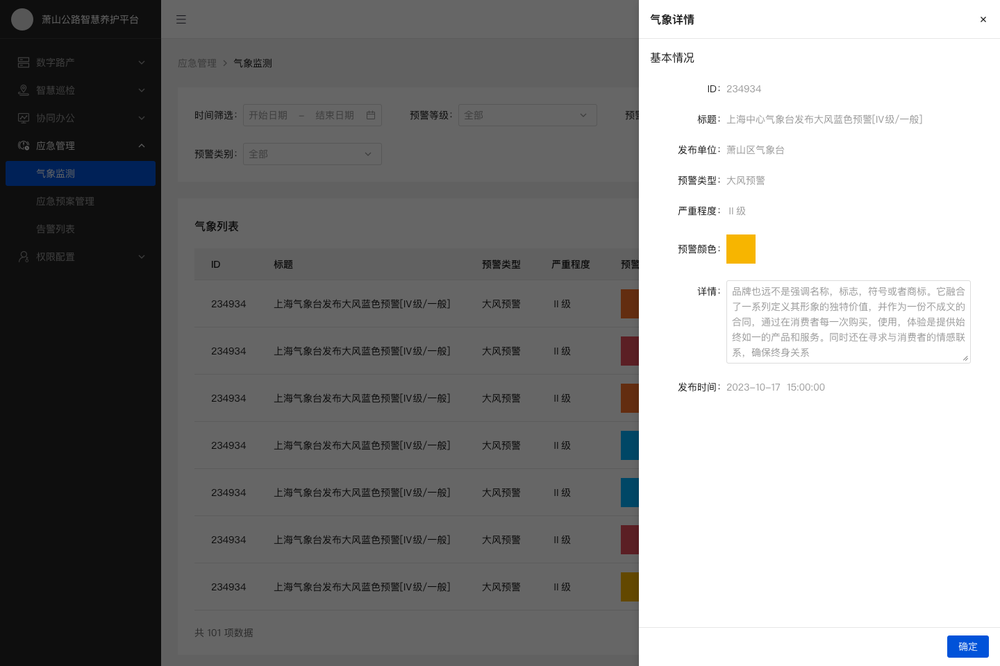

---
# 这是文章的标题
title: 项目规范
# 这是侧边栏的顺序
order: 2
# 设置作者
author: MoTou
# 设置写作时间
date: 2024-01-19
# 一个页面可以有多个标签
tag:
  - 规范
---
## 现状
不同的前端同学开发时，对于组件的使用，没有统一的规范，导致页面组件样式不统一。

为此我们制定了统一规范，保证同一个系统组件使用一致，提高开发效率、还原设计稿。

::: info
特别备注：开发同学在做的时候希望能仔细查看设计稿，尽量还原设计稿，如果有组件上的问题，及时沟通。
:::

## 页面布局

### 规则说明
以交投中的页面为例子：

1. 【间隔】页面中块与块之前的区域间隔，保持`24px`, 模块与模块之间的间距基本为8的倍数。 
2. 【搜索栏】查询条件栏，规定一行展示3个条件，输入框/选择框宽度保持自适应，2个条件间距24px。 统一使用封装方法[`BaseSearchBar`](/components/base/BaseSearchBar)来渲染列表查询条件。
3. 【表格】表格中列的宽度，如果没有强烈要求全部展示，一行超过规定字数，就用`...`表示，鼠标移入可以看到完整字段。 
4. 【表格】表格中`操作`一栏，列命名`op`。非特殊情况，不允许自定义内容，统一使用封装方法`renderOperator`来渲染操作按钮。 
5. 【表格】表格中，内容空白情况，请用`-`展示，如果有特殊情况及时和产品经理沟通 
6. 【表格】表格中，“开关”组件，使用`small`尺寸高度`24px`
7. 【弹窗样式】基本弹窗：宽度`600px`，大弹框：宽度`1200px`。 
8. 【抽屉样式】基本抽屉：宽度`520px`，大抽屉：宽度`1000px`。

### 图片示例






### 修改前后示意














这里要放到公共方法的功能文档中
### 操作按钮`renderOperator`使用方法

- 删除按钮：`theme：warning` 其它默认: `theme: primary`
- 确认框：`pop.show` 默认：false, 传入true则为展示确认框

示例：
```typescript
{
  title: '操作',
  colKey: 'op',
  fixed: 'right',
  const configs: OperatorConfigItem[] = [
    { name: '详情', attrs: { onClick: () => onOpenPage(row, 'BaseInfoCulvertDetail') } },
    {
      name: '删除',
      attrs: { theme: 'danger' },
      pop: {
        show: true,
        content: '是否删除',
        onConfirm: () => onHandle({ ...row, type: 'DELETE' }),
      },
    },
  ];
	return renderOperator(configs);
}
```

